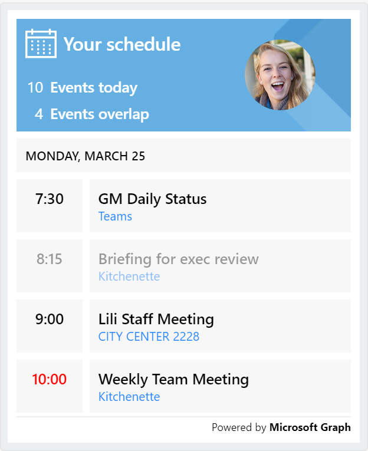

# Adaptive Cards & Themes Spec

|Area|
|-|
|Virtual Assistant|

## Goals

### Design

* The default **Fabric** theme uses UI elements that match the out-of-the-box Web Chat and Adaptive Card design.
* Additional themes will be provided maintaining the same layout, but different image assets and an Adaptive Card host config JSON (to be used in a custom Web Chat) will be used.
* Cards will be used as supplemental UX to speech and text scenarios. They should avoid interactive UI elements as this requires additional data processing that may not have cross-channel coverage.

### Development
* Developers can unpack a zipped file of image assets and an Adaptive Card host JSON.
* Image assets should maintain consistent names between design packs to enable easy asset replacement.
* When deployed with a Virtual Assistant, assets from individual skills should surface up to the root web app.

## Common Elements

### Icons
Every Skill will require a unique icon to identify itself.

### Header
Every card will have a header identifying itself with a Skill icon.

### Users
User avatars should be displayed when possible, and default to a user's initials if one is unavailable.

## Cards

### Virtual Assistant

### Calendar Skill

#### [Schedule](./calendar/schedule.json)

### Email Skill

### To Do Skill

### Point of Interest Skill