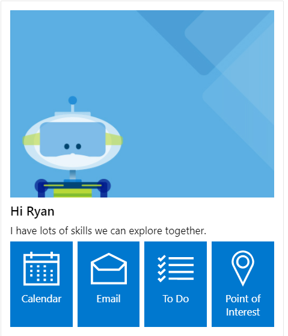
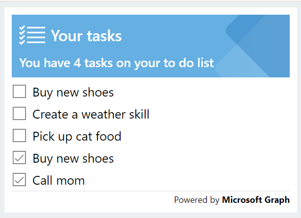
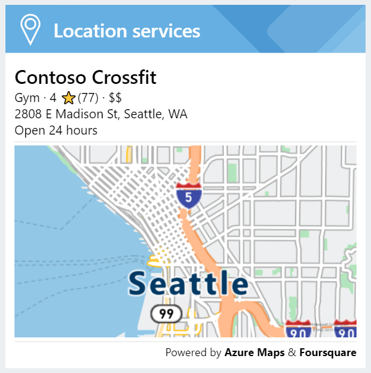

# Adaptive Cards & Themes Spec

|Area|
|-|
|Virtual Assistant|

## Goals

### Design

* The default **Fabric** theme uses UI elements that match the out-of-the-box Web Chat and Adaptive Card design.
* Additional themes will be provided maintaining the same layout, but different image assets and an Adaptive Card host config JSON (to be used in a custom Web Chat) will be used. If necessary, they will include card JSONs for alternative text properties to render well on the background.
* Cards will be used as supplemental UX to speech and text scenarios. They should avoid interactive UI elements as this requires additional data processing that may not have cross-channel coverage.

### Development
* Developers can unpack a zipped file of image assets and an Adaptive Card host JSON.
* Image assets should maintain consistent names between design packs to enable easy asset replacement.
* When deployed with a Virtual Assistant, assets from individual skills should surface up to the root web app.
* Developers should be able to easily deploy new asset packs into an existing Virtual Assistant & Skills.

## Common Elements

### Icons
Every Skill will require a unique icon to identify itself.

### Header
Every card will have a header identifying itself with a Skill icon. Since the current version of Adaptive Cards only supports a single background image, those images should account for the header space to remain unchanged.
The preferred solution would be to assign background images to individual containers.

### Users
User avatars should be displayed when possible, and default to a user's initials if one is unavailable (use same API as web chat).

|User Avatar|Initials Avatar|
|-|-|
|||
### Text
Elements should have the appropriate color assigned based on their data status. For example, conflicting calendar appointments should use the alert or warning color.

## Cards

### Virtual Assistant
#### [Introduction to a new user](./virtualassistant/newuserintroduction.json)

#### [Introduction to a returning user](./virtualassistant/returninguserintroduction.json)

* We should show a different introduction card than what is used for new users.
    * Now that the onboarding dialog is disabled by default, there is no way to discern the difference to the user.
* Use repeating columnset row of 4 columns for registered skills (max 8 or 12?)
* Each Skill column has an ImBack submit action to trigger it with a sample query.

### Calendar Skill

#### [Schedule](./calendar/schedule.json)

* Event data is split into 2 text blocks in individual columns. These may be able to be better organized to ease generation by code.
* Default alert/warning/accent (orange/red/blue) colors do not show up well on dark blue background.

#### [Overview](./calendar/overview.json)

### Email Skill

#### [Overview](./email/overview.json)

* Emails grouped by user are separated into repeating containers.
* Default alert/warning (orange/red) colors do not show up well on dark blue background.

#### [Message](./email/message.json)

* Using maximum 5 lines to display email message

### To Do Skill
#### [Show To Do](./todo/show.json)

* Tasks are separated into repeating containers.

### Point of Interest Skill

#### [Details](./pointofinterest/details.json)

#### [Route Details](./pointofinterest/routedetails.json)
