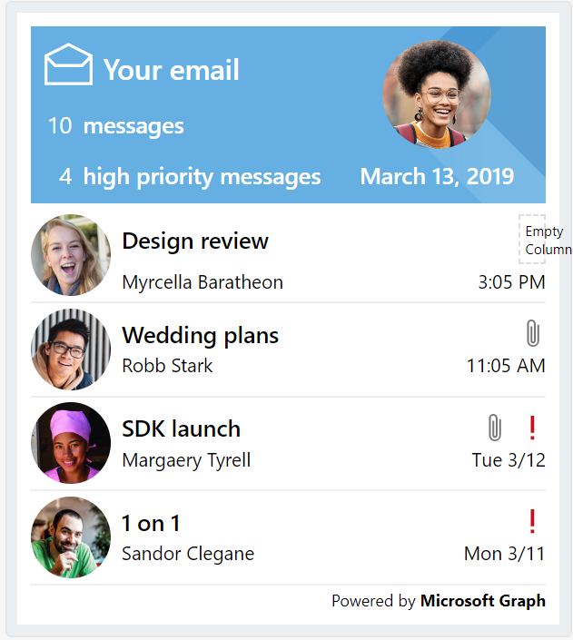
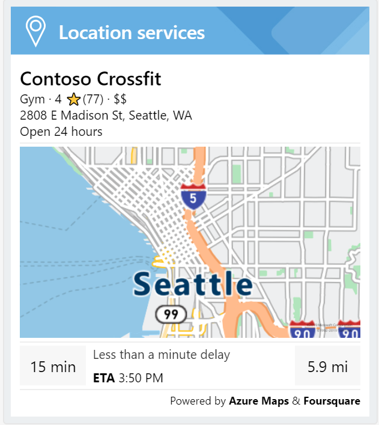

# Adaptive Cards & Themes Spec

|Area|
|-|
|Virtual Assistant|

## Goals

### Design

* The default **Fabric** theme uses UI elements that match the out-of-the-box Web Chat and Adaptive Card design.
* Additional themes will be provided maintaining the same layout, but different image assets and an Adaptive Card host config JSON (to be used in a custom Web Chat) will be used.
* Cards will be used as supplemental UX to speech and text scenarios. They should avoid interactive UI elements as this requires additional data processing that may not have cross-channel coverage.

### Development
* Developers can unpack a zipped file of image assets and an Adaptive Card host JSON.
* Image assets should maintain consistent names between design packs to enable easy asset replacement.
* When deployed with a Virtual Assistant, assets from individual skills should surface up to the root web app.

## Common Elements

### Icons
Every Skill will require a unique icon to identify itself.

### Header
Every card will have a header identifying itself with a Skill icon. Since the current version of Adaptive Cards only supports a single background image, those images should account for the header space to remain unchanged.

### Users
User avatars should be displayed when possible, and default to a user's initials if one is unavailable.

### Text
Elements should have the appropriate color assigned based on their data status. For example, conflicting calendar appointments should use the alert or warning color.

## Cards

### Virtual Assistant
#### Introduction

### Calendar Skill

#### [Schedule](./calendar/schedule.json)

* Event data is split into 2 text blocks in individual columns, which may

#### [Overview](./calendar/overview.json)

### Email Skill

#### [Overview](./email/overview.json)

#### [Message](./email/message.json)

### To Do Skill

### Point of Interest Skill

#### [Details](./pointofinterest/details.json)

#### [Route Details](./pointofinterest/routedetails.json)
